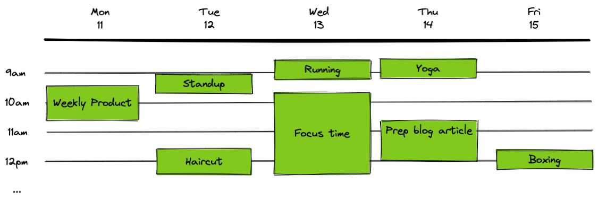

# Frontend engineering challenge

Thank you for taking the time to complete this coding challenge 🙏

## Instructions

Clone this repository and publish it to your github, making sure it is private.

While you code, please commit as often as you can, **at the very least for each part you complete**.

**Don't spend more than a few hours**. We would like to assess your pragmatism and the choices you make.

It's okay if it is not perfect or if you don't have time to complete more than Part 1.
You can answer questions orally and elaborate on how you would have done during the following debrief interview.

When you are done, push your code to Github, invite `jrmdayn`+`brunovegreville` and send us an email: [jeremie@hera.so](mailto:jeremie@hera.so) - we will be in touch shortly to schedule a debrief interview.

## The challenge

This repository contains the basic scaffolding of a React app and a [dataset](./src/dataset.json) of real calendar events, spanning from _2021-10-11_ until _2021-10-15_.

The 3 main parts of this challenge are as follows:

#### Part 1

Place all the events from the dataset on a weekly view (Monday 11th to Friday 15th) that would look a bit like this:

Question: how would you handle conflicting events, eg two events that overlap in time ( `eventA.end_date > eventB.start_date`)?
 

#### Part 2

Use all 4 arrows ⬆️ ⬇️ ⬅️ ➡️ to navigate from one event to the next. You can for example emphasise the focus on one event by changing its border, but feel free to represent focus as you'd like.
 

#### Part 3

Click on an event to focus and display more information about the event on the side panel.
